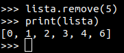
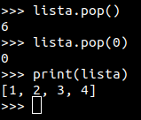
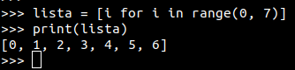
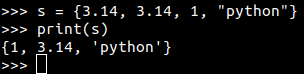
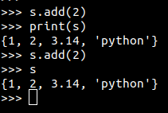
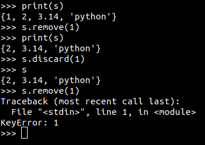
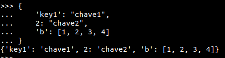
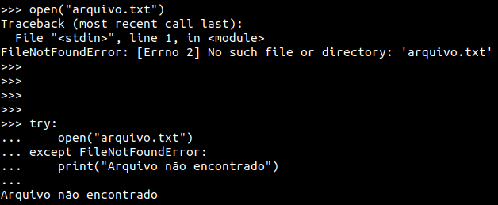

# Python 3

[__TOC__]

## Conceitos Básicos

### Variáveis

Exemplos de alguns tipos simples de variáveis:

* int: 1, 10, 15, 30000000000000;
* float: 3.42, 1.2;
* str: 'Python', "DevOps";
* bool: True/False;

O tipo de uma variável é definido pelo valor que ela recebe.

### Operações Matemáticas

#### Operadores Aritméticos

* \+   
  * `x + 10`
* \-   
  * `x - 10`
* \*   
  * `x * 10`
* /    
  * `x / 10`
* \*\* 
  * `x ** 2`
* %    
  * `x % 10`

## Entrada e saída

### Entrada

```python
nome = input('Digite seu nome: ')
```

### Saída

```python
print('Olá, ' + nome)
```

## Blocos Condicionais

Para controle de fluxo python possui os blocos if, elif e else.

```python
if  x > 10:
    print('x é maior que 10')
elif x < 10:
    print('x é menor que 10')
else:
    print('x é igual a 10')
```

Python também possui um if ternário (apenas uma linha).

```python
x = 10 if x > 10 else 0
```


### Operadores Relacionais

|Operador |	Descrição | Exemplo
| ------- | ---------- | --------
|== | Igual	| (A == B) | false
|!= | Não igual	| (A != B) | true
|> | Maior que	| (A > B) | false
|< | Menor que	| (A < B) | true
|>= | Maior ou igual que | (A >= B) | false
|<= | Menor ou igual que | (A <= B) | true

### Operadores Lógicos

|Operador | Exemplo | Saída
| ------- | -------- | --------
| and | (A and B) | True se A E B são True, False caso contrário
| or |  (A or B) | True se A OU B são True, False caso contrário
| not | (not B) | True se B é False, False caso contrário

## Bloco de Repetição

Para laços de repetição Python possui duas instruções: while e for.

### while

Executa um bloco de código enquanto uma codição for verdadeira.

```python
x = 10
while x < 10:
    print(x)
    x = x - 1
```

### for

Executa um bloco de código para item de uma conjunto de dados.

```python
s = 'Python'
for letra in s:
    print(letra)
```

## Estrutura de Dados

Python possui 3 estruturas de dados padrão: lista, tupla, set e dicionário.

### Lista

Listas são uma sequencia de objetos, portanto podem conter itens de qualquer tipo.

```python
lista = [1, 2, 3, 4, 5]
print(lista)
lista2 = [1, "a", True, 3.14]
```

Para adicionar um item em uma lista usar o método append.

```python
lista.append(6)
```

Para remover um item de uma lista podemos usar o método remove ou pop. O método remove remove o item especificado, o método pop remove o último item da lista ou o item de dada posição retornando o item removido.

**remove**:



**pop**:




#### List Comprehension

Para criar uma lista podemos utilizar também o list comprehension.



## Tupla

Tuplas são semelhantes a listas mas são imutáveis. Isso quer dizer que uma tupla, depois de criada, não pode ser alterada.

```python
tupla = (1, 2, 3, 4, 5)
print(tupla)
tupla2 = (1, "a", True, 3.14)
```

> Não existe tuple comprehension!

## Set

Sets também são muito semelhantes a listas, mas não permitem itens repetidos.

```python
s = {3.14, 3.14, 1, "python"}
```

No exemplo acima o set será criado sem erro mas apenas um dos itens `3.14` será adicionado.




Para adicionar um item no set podemos utilizar o método add.



Para remover um item podemos utiliar o método remove ou discard.



> Note que o método remove dispara uma exception caso o item não exista no set e o método discard não dispara nenhuma exception.

## Dicionário

O dicionário é a implementação de uma estrutura chave valor. A chave precisa ser de tipos primitivos e o valor pode ser de qualquer tipo.



Para adicionar um valor do dicionário basta referenciar a chave dentro de colchetes.

```python
print(d["chave1"])
```

> Se a chave não existir no dicionário será retornado um erro.

Também é possível através do método get.

```python
value = d.get("chave1")
print(value)
```

> O método get retorna None caso a chave não exista.

Para adicionar itens no dicionário basta fazer como no exemplo abaixo.

```python
d["chave2"] = "valor2"
print(d["chave2"])
```

Se a chave for repetida o valor será substituido.

Por fim, para remover um item do dicionário podemos utilizar a palavra-chave del.

```python
d["chave2"] = "valor2"
del d["chave2"]
print(d["chave2"])
```

> Note que o exemplo acima irá disparar uma exception no comando print pois a chave foi deletada na instrução anterior.

## Arquivos


## Exceptions

A exception representa uma anomalia ou uma situação que precisa ser tratada especificamente. Quando uma exception é lançada o programa é interrompido e a mensagem de erro é exibida. Podemos evitar que isso aconteça usando o try/except.



## Funções

Funções são um bloco de código associado a um nome e que pode ser executado a qualquer momento. A função pode receber parâmetros e retornar um valor.

```python
def soma(a, b):
    return a + b

resultado = soma(1, 2)
print(resultado)
```

É possível criar uma função que recebe um número infinito de parametros posicionais.

```python
def somatorio(*nums):
    resultado = 0
    for num in nums:
        resultado += num
    return resultado

soma = somatorio(1,2,3,4,5)
print(soma)
```

Também é possível criar uma função que recebe um número infinito de parametros nomeados.

```python
def welcome(nome, **kwargs):
    print("Olá " + nome)

    local = kwargs.get('local')
    if local:
        print("Seja bem vindo de volta a " + local)

welcome("Wesley", local="Softplan")
```

